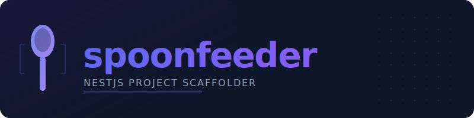

<p align="center">
  
</p>

<p align="center">
  <a href="https://www.npmjs.com/package/spoonfeeder"></a>
  <a href="https://www.npmjs.com/package/spoonfeeder"></a>
  <a href="https://github.com/bbjansen/spoonfeeder/blob/main/LICENSE"></a>
  <a href="https://nodejs.org/"></a>
  <a href="https://github.com/bbjansen/spoonfeeder/actions"></a>
  <a href="https://github.com/bbjansen/spoonfeeder/blob/main/docs/contributing.md"></a>
</p>

<p align="center">
  
  
  
  
  
  
  
  
  
  
  
  
  
  
  
  
  
  
  
  
  
  
  
</p>

<p align="center">
  
  
  
</p>

---

Interactive CLI that scaffolds production-ready, AI-friendly NestJS projects with 112 composable recipes. Pick a project type, choose your stack, and get a working codebase with structured error handling, test scaffolds, AI assistant context, and deployment configs — ready to ship, not "just fill in the rest yourself."

## Quick Start

```bash
npx spoonfeeder
```

Or with pnpm:

```bash
pnpm dlx spoonfeeder
```

One command. The CLI walks you through project name, type, cloud provider, and recipe selection, then generates everything to disk.

## What It Looks Like

```
┌  spoonfeeder — NestJS Project Generator
│
◇  Project name
│  my-api
│
◆  Project type
│  ● HTTP REST API (Fastify)
│  ○ AWS Lambda
│  ○ Microservice
│  ○ CLI Application
│  ○ Scheduled Worker
│  ○ Monorepo (Nx)
│  ○ Full-Stack
│
◇  Cloud provider
│  AWS
│
◆  Select recipes
│  ◼ TypeORM + PostgreSQL
│  ◼ JWT Authentication
│  ◼ Swagger / OpenAPI
│  ◼ Pino Logging
│  ◼ Health Checks
│  ◼ Helmet Security Headers
│  ◻ Rate Limiting
│  ◻ CORS
│  ◻ OpenTelemetry
│  ◻ Prometheus
│  ... 103 more available
│
◇  Confirm
│  Project:    my-api
│  Type:       HTTP REST API
│  Cloud:      AWS
│  Add-ons:    typeorm-postgres, jwt-auth, swagger, pino, health-checks, helmet
│  Directory:  ./my-api
│
◒  Creating project structure...
│
◇  Project structure created.
│
│  Next steps
│  cd my-api
│  pnpm start:dev
│
└  Project created successfully!
```

## Project Types

Seven project archetypes, each with tailored defaults, directory structure, and compatible recipe sets:

| Type               | Description                                                  |
| ------------------ | ------------------------------------------------------------ |
| HTTP REST API      | Fastify adapter with validation, Swagger, and error handling |
| AWS Lambda         | Serverless handler configured for Lambda deployments         |
| Microservice       | Event-driven service with transport layer (TCP, NATS, etc.)  |
| CLI Application    | Command-line tool built on nest-commander                    |
| Scheduled Worker   | Cron-based background jobs with @nestjs/schedule             |
| Monorepo           | Nx workspace with shared libraries and code generators       |
| Full-Stack         | NestJS backend + frontend (Next.js, Vite, Nuxt, SvelteKit)   |

## Recipe Categories

| Category         | Count   | Examples                                              |
| ---------------- | ----:   | ----------------------------------------------------- |
| API Patterns     |    15   | Pagination, versioning, JSON Patch, SSE, i18n         |
| Cloud — AWS     |    12   | SQS, SNS, S3, DynamoDB, Cognito, EventBridge          |
| Auth             |    11   | JWT, Passport, OAuth, RBAC, MFA, DPoP                 |
| Database         |    10   | TypeORM, Prisma, Drizzle, MikroORM, Mongoose, Kysely  |
| Cloud — GCP     |    10   | Pub/Sub, Cloud SQL, Firestore, Cloud Functions        |
| Cloud — Azure   |    10   | Service Bus, Cosmos DB, Blob Storage, Functions       |
| Developer XP     |     7   | DevContainers, feature flags, circuit breaker         |
| Security         |     6   | Helmet, CORS, CSRF, throttling, data masking          |
| Operational      |     5   | Graceful shutdown, multi-tenancy, worker threads      |
| Repo Hygiene     |     4   | Changelog, license headers, Dependabot/Renovate       |
| Observability    |     3   | OpenTelemetry, distributed tracing, request logging   |
| Queues           |     3   | RabbitMQ, BullMQ, dead letter queues                  |
| Monitoring       |     2   | Health checks, Prometheus                             |
| Logging          |     2   | Pino, Winston                                         |
| Error Tracking   |     2   | Sentry, Seq                                           |
| Email            |     2   | Nodemailer, SendGrid                                  |
| + 8 more         |     8   | WebSockets, GraphQL, CQRS, Storage, Testing, Docs     |
| **Total**        | **112** |                                                       |

Each recipe ships its own dependencies, environment variables, configuration module, source files, tests, and AI context. Recipes declare conflicts and requirements explicitly, so the CLI rejects incompatible combinations before anything hits disk.

### Highlighted Recipes

**Database** — TypeORM (Postgres, MySQL), Prisma, Drizzle, MikroORM, Mongoose, Kysely, Redis, database seeding, database factories

**Auth** — JWT, Passport strategies, API keys, RBAC via CASL, OAuth2 introspection, OAuth providers (Google, GitHub, Apple), MFA/TOTP, DPoP (RFC 9449)

**Cloud** — Full recipe sets for AWS (SQS, SNS, S3, EventBridge, DynamoDB, Cognito, Secrets Manager, and more), GCP (Pub/Sub, Cloud SQL, Firestore, Cloud Functions), and Azure (Service Bus, Cosmos DB, Blob Storage, Functions)

**API Patterns** — Pagination, filtering, API versioning, HTTP caching (RFC 9111), JSON Patch (RFC 6902), Prefer header (RFC 7240), Content Digest (RFC 9530), SSE, soft delete, audit trail, i18n

**Observability** — OpenTelemetry, distributed tracing, Prometheus metrics, structured request logging with correlation IDs

## AI-Ready Projects

Every generated project ships with AI assistant context tailored to your exact stack. When you select recipes, spoonfeeder generates project-specific instructions for three major AI coding assistants:

| File | Assistant | What it contains |
|------|-----------|-----------------|
| `CLAUDE.md` | Claude Code | Project architecture, selected recipes, testing conventions, error patterns, available commands |
| `.cursor/rules/project.mdc` | Cursor | Combined rules for all selected recipes with usage patterns and constraints |
| `.github/copilot-instructions.md` | GitHub Copilot | Stack overview, coding standards, recipe-specific guidance |

The AI context is not generic boilerplate — it reflects the specific recipes you selected. If you pick TypeORM + PostgreSQL + JWT Auth + Swagger, the generated `CLAUDE.md` describes those exact integrations, how they're wired, and how to extend them. Your AI assistant understands your project from the first prompt.

When you add or remove recipes post-scaffolding via Nx generators, the AI context files are updated automatically.

## What You Get

Every generated project includes:

- **RFC 9457 error responses** — Typed error hierarchy with trace codes and Problem Details for HTTP APIs
- **Test scaffolds** — Unit, integration, and E2E test structure with shared factories and per-recipe test files
- **Exact dependency versions** — No `^`, no `~`, no supply-chain surprises. Every version is pinned.
- **Husky + commitlint + lint-staged** — Conventional commits and code formatting enforced from the first commit
- **Per-environment configs** — Separate `.env` files for development, test, and production with recipe-specific variables
- **Docker Compose** — Dev-ready container setup for databases, caches, and message brokers matching your recipes
- **Nx generators** — Add, remove, or migrate recipes after scaffolding without manual wiring
- **CI/CD templates** — GitHub Actions workflows for test, lint, build, and deploy

No runtime dependency on spoonfeeder. The generated project is a standard NestJS application. Eject and own your code from day one.

### How It Works

1. **Run the CLI** — Answer a few prompts: project name, type, cloud provider, recipes
2. **Recipes resolve** — Dependencies, conflicts, and requirements are validated automatically
3. **Project generates** — Source files, configs, environment variables, tests, and AI context are written to disk
4. **Start building** — `cd` into the project, install, and run `pnpm start:dev`

## Post-Scaffolding (Nx Generators)

Recipes are not frozen at scaffolding time. Spoonfeeder ships Nx generators so you can evolve your stack after project creation:

```bash
# Add a recipe to an existing project
nx g spoonfeeder:add --recipe=swagger

# Remove a recipe cleanly (deps, config, source files, tests)
nx g spoonfeeder:remove --recipe=swagger

# Migrate between compatible recipes
nx g spoonfeeder:migrate --from=typeorm-postgres --to=prisma

# List all available and installed recipes
nx g spoonfeeder:list
```

Add what you need, remove what you don't. No lock-in.

## Documentation

Full docs at **[bbjansen.github.io/spoonfeeder](https://bbjansen.github.io/spoonfeeder/)**

| Section | What it covers |
| ------- | -------------- |
| [Quick Start](https://bbjansen.github.io/spoonfeeder/getting-started/quick-start/) | Installation, CLI walkthrough, generated structure |
| [Project Types](https://bbjansen.github.io/spoonfeeder/getting-started/project-types/) | Deep dive into each of the 7 archetypes |
| [Recipe Catalog](https://bbjansen.github.io/spoonfeeder/recipes/all/) | Full list of all 112 recipes with dependencies |
| [Nx Generators](https://bbjansen.github.io/spoonfeeder/generators/) | Add, remove, migrate, and list recipes |
| [Architecture](https://bbjansen.github.io/spoonfeeder/architecture/) | Generator pipeline, error handling, standards |

## Requirements

- Node.js >= 22.0.0
- pnpm >= 9.0.0 (recommended) or npm

## Contributing

Contributions welcome. See [docs/contributing.md](docs/contributing.md) for setup instructions, branch naming conventions, and the development workflow.

## Author

**B.B. Jansen** — [github.com/bbjansen](https://github.com/bbjansen)

## License

MIT — BBJ Systems Holding
