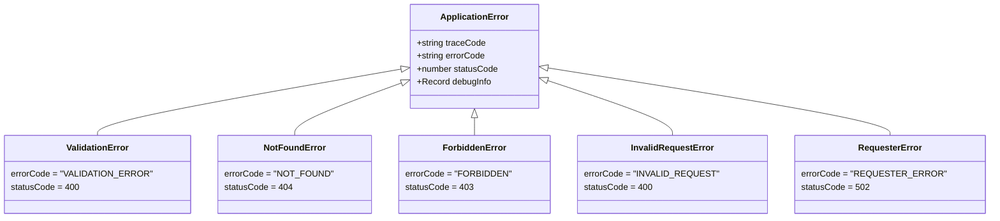
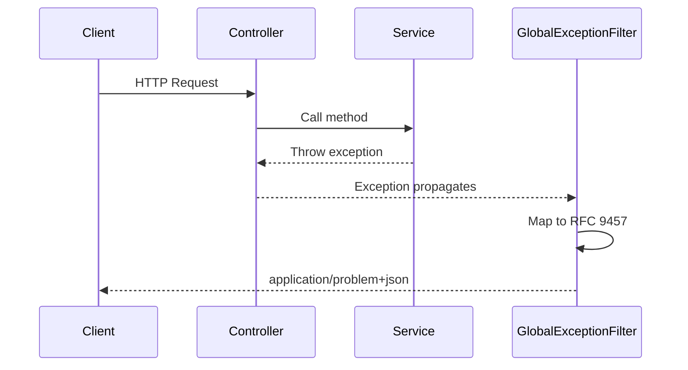

# Error Handling

Every generated project includes structured error handling based on RFC 9457 (Problem Details for HTTP APIs).

## Error Response Format

All error responses are served with `Content-Type: application/problem+json` and follow the [RFC 9457](https://datatracker.ietf.org/doc/html/rfc9457) Problem Details structure.

### Production response

In production (`NODE_ENV=production`), `debugInformation` is always `null`:

```json
{
  "type": "urn:error:not-found",
  "title": "Not Found",
  "status": 404,
  "detail": "User with ID 999 was not found",
  "instance": "/api/users/999",
  "traceCode": "A_NF_00001",
  "errorCode": "NOT_FOUND",
  "timestamp": "2024-01-07T12:00:34.567Z",
  "debugInformation": null
}
```

### Development response

In non-production environments, `debugInformation` includes the stack trace and any debug context passed to the error constructor:

```json
{
  "type": "urn:error:not-found",
  "title": "Not Found",
  "status": 404,
  "detail": "User with ID 999 was not found",
  "instance": "/api/users/999",
  "traceCode": "A_NF_00001",
  "errorCode": "NOT_FOUND",
  "timestamp": "2024-01-07T12:00:34.567Z",
  "debugInformation": {
    "queriedTable": "users",
    "queriedId": "999",
    "stack": [
      "NotFoundError: User with ID 999 was not found",
      "    at UserService.findOne (/app/src/users/user.service.ts:42:11)",
      "    at UserController.getUser (/app/src/users/user.controller.ts:18:25)"
    ]
  }
}
```

### Standard RFC 9457 Fields

| Field | Type | Description |
| --- | --- | --- |
| `type` | `string` | URI reference identifying the problem type. Uses the `urn:error:{code}` scheme, derived from the `errorCode` by lowercasing and replacing underscores with hyphens (e.g., `NOT_FOUND` becomes `urn:error:not-found`) |
| `title` | `string` | Short human-readable summary derived from the HTTP status code (e.g., `"Not Found"`, `"Bad Request"`) |
| `status` | `number` | HTTP status code as an integer |
| `detail` | `string` | Human-readable explanation specific to this occurrence of the problem |
| `instance` | `string` | The request path where the error occurred (e.g., `/api/users/999`) |

### Extension Fields

| Field | Type | Description |
| --- | --- | --- |
| `traceCode` | `string` | A unique identifier for this error occurrence — designed to be grep-searchable in logs. See [Trace Codes](#trace-codes) below |
| `errorCode` | `string` | Machine-readable error code in uppercase snake_case (e.g., `NOT_FOUND`, `VALIDATION_ERROR`) |
| `timestamp` | `string` | ISO 8601 timestamp of when the error occurred |
| `debugInformation` | `object \| null` | Additional debug context including the stack trace. Always `null` in production to prevent information leakage |

## Exception Hierarchy

### ApplicationError Class Hierarchy

The custom error hierarchy extends `Error` with trace codes and structured metadata:



### Request Error Flow

When an exception is thrown, the `GlobalExceptionFilter` catches it and produces an RFC 9457 response:



### Built-in NestJS Exceptions

NestJS provides built-in HTTP exceptions. Use them directly or extend for domain-specific errors:

```
HttpException
  +-- BadRequestException        (400)
  +-- UnauthorizedException      (401)
  +-- ForbiddenException         (403)
  +-- NotFoundException          (404)
  +-- ConflictException          (409)
  +-- UnprocessableEntityException (422)
  +-- InternalServerErrorException (500)
  +-- ServiceUnavailableException  (503)
```

### Custom Domain Exceptions

Extend `HttpException` for domain-specific errors that carry additional context:

```typescript
import { HttpException, HttpStatus } from '@nestjs/common';

export class InsufficientStockException extends HttpException {
  constructor(productId: string, requested: number, available: number) {
    super(
      {
        errorCode: 'INSUFFICIENT_STOCK',
        message: `Product ${productId} has ${available} units available, ${requested} requested`,
        details: { productId, requested, available },
      },
      HttpStatus.CONFLICT,
    );
  }
}
```

### Creating a Custom ApplicationError Subclass

For errors that need a stable trace code and structured debug information, extend `ApplicationError` instead of `HttpException`. This gives you full control over the RFC 9457 output via the `GlobalExceptionFilter`.

The `ApplicationError` constructor accepts:

| Parameter | Type | Default | Description |
| --- | --- | --- | --- |
| `message` | `string` | — | Human-readable error detail |
| `traceCode` | `string` | — | Static, grep-searchable trace code (see [Trace Codes](#trace-codes)) |
| `errorCode` | `string` | — | Machine-readable error code (uppercase snake_case) |
| `statusCode` | `number` | `500` | HTTP status code |
| `debugInfo` | `Record<string, unknown>` | `undefined` | Additional context (stripped in production) |

Create a subclass that fixes the `errorCode` and `statusCode`, leaving only the message and trace code for callers to provide:

```typescript
import { ApplicationError } from '@/shared/errors/application.error';

export class InsufficientStockError extends ApplicationError {
  constructor(
    productId: string,
    requested: number,
    available: number,
  ) {
    super(
      `Product ${productId} has ${available} units available, ${requested} requested`,
      'A_IS_00001',       // static trace code for this error type
      'INSUFFICIENT_STOCK',
      409,                // HTTP 409 Conflict
      { productId, requested, available },
    );
  }
}
```

Use it in a service:

```typescript
import { InsufficientStockError } from '@/orders/errors/insufficient-stock.error';

async placeOrder(productId: string, quantity: number): Promise<Order> {
  const product = await this.productRepo.findOneOrFail(productId);

  if (product.stock < quantity) {
    throw new InsufficientStockError(productId, quantity, product.stock);
  }

  // ...proceed with order
}
```

The `GlobalExceptionFilter` automatically produces the following response:

```json
{
  "type": "urn:error:insufficient-stock",
  "title": "Conflict",
  "status": 409,
  "detail": "Product abc-123 has 5 units available, 10 requested",
  "instance": "/api/orders",
  "traceCode": "A_IS_00001",
  "errorCode": "INSUFFICIENT_STOCK",
  "timestamp": "2024-01-07T12:00:34.567Z",
  "debugInformation": null
}
```

The existing subclasses in `src/shared/errors/` follow the same pattern:

| Class | Error Code | Status | Use case |
| --- | --- | --- | --- |
| `ValidationError` | `VALIDATION_ERROR` | 400 | Input fails business validation rules |
| `InvalidRequestError` | `INVALID_REQUEST` | 400 | Request is structurally invalid |
| `ForbiddenError` | `FORBIDDEN` | 403 | Authenticated but not authorized |
| `NotFoundError` | `NOT_FOUND` | 404 | Resource does not exist |
| `RequesterError` | `REQUESTER_ERROR` | 502 | Downstream service returned an error |

## Trace Codes

Trace codes are short, static identifiers embedded in every error response. They make it possible to search logs for a specific error type without relying on free-text message matching.

### Format

Trace codes follow the pattern `{PREFIX}_{CATEGORY}_{SEQUENCE}`:

| Segment | Description | Example |
| --- | --- | --- |
| Prefix | Application or module identifier | `A` (application-level) |
| Category | Two-letter abbreviation of the error category | `NF` (not found), `VE` (validation error), `IS` (insufficient stock) |
| Sequence | Five-digit zero-padded number, unique within the category | `00001` |

Examples: `A_NF_00001`, `A_VE_00003`, `A_IS_00001`

### How They Work

**In `ApplicationError` subclasses**, the trace code is passed to the constructor and is static — the same code always means the same error type. This makes it easy to:

- Search logs: `grep A_NF_00001 /var/log/app.log`
- Set alerts: trigger on specific trace codes in your monitoring system
- Document known errors: link trace codes to runbooks or documentation

**For `HttpException` and unknown errors**, the `GlobalExceptionFilter` generates a dynamic trace code using the pattern `ERR_{timestamp}_{random}` (e.g., `ERR_1704628834567_X7K2M1`). These are unique per occurrence rather than per error type.

### Best Practices

- Assign a unique trace code to each distinct error scenario, not each throw site. If the same error can be thrown from multiple places, use the same trace code.
- Keep a registry of trace codes in your project documentation or as comments in the error class file.
- Never reuse a trace code for a different error — retire old codes rather than reassigning them.

## Error Codes

Use uppercase snake_case error codes that are stable and machine-readable:

| Code | HTTP Status | Description |
| --- | --- | --- |
| `VALIDATION_ERROR` | 400 | Request body/params invalid |
| `UNAUTHORIZED` | 401 | Missing or invalid credentials |
| `FORBIDDEN` | 403 | Authenticated but not permitted |
| `NOT_FOUND` | 404 | Resource does not exist |
| `CONFLICT` | 409 | Resource state conflict |
| `RATE_LIMITED` | 429 | Too many requests |
| `INTERNAL_ERROR` | 500 | Unexpected server error |
| `SERVICE_UNAVAILABLE` | 503 | Downstream dependency failure |

## Global Exception Filter

The `GlobalExceptionFilter` (in `src/shared/filters/http-exception.filter.ts`) maps all exceptions to RFC 9457 problem details. It handles three cases:

1. **`ApplicationError` subclasses** — Uses the error's own `errorCode`, `traceCode`, and `debugInfo`
2. **`HttpException` instances** — Derives the `errorCode` from the HTTP status and generates a trace code
3. **Unknown exceptions** — Treated as 500 Internal Server Error with a generated trace code

The `type` field uses the `urn:error:{error-code}` scheme (e.g., `urn:error:not-found`).

## When to Throw vs. When to Return

### Throw an Exception When

- The operation cannot continue (missing resource, invalid state)
- The caller made an error (bad input, unauthorized)
- A downstream service is unavailable
- A business rule is violated

```typescript
async findOne(id: string): Promise<Order> {
  const order = await this.orderRepo.findOne({ where: { id } });
  if (!order) {
    throw new NotFoundException(`Order ${id} not found`);
  }
  return order;
}
```

### Return a Result When

- The outcome is expected and the caller needs to branch on it
- You are building a shared utility where exceptions would be surprising
- Performance-critical paths where exception overhead matters

## Logging Errors

| Severity | Log Level | What to Include |
| --- | --- | --- |
| 5xx | `error` | Stack trace, traceId, request context |
| 4xx | `warn` | Error code, traceId, request path |
| Expected | `debug` | Business rule violation details |

!!! warning "What NOT to log"
    Never log passwords, tokens, API keys, full request bodies with PII, or credit card numbers.
