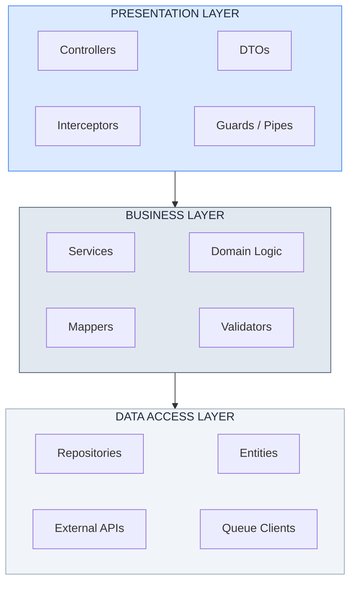
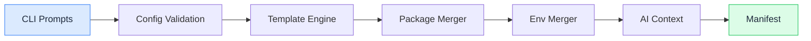
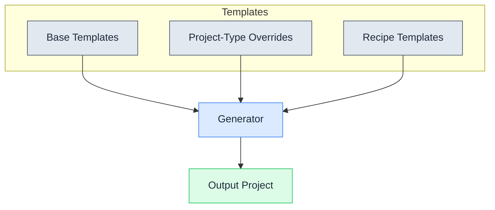

# Architecture Overview

Projects generated by spoonfeeder follow a simplified 3-layer architecture designed for clarity and maintainability.

## Layered Architecture



## Generator Pipeline

The scaffolding process follows a linear pipeline from user input to a fully generated project:



## Template Layers

Templates are composed from three layers. The generator merges them into the final output project:



## Key Principles

- **Single Responsibility** — Each class should have one reason to change
- **Dependency Inversion** — Depend on abstractions, not concretions
- **Maximum 3 Dependencies** — A class should inject no more than 3 dependencies (excluding Logger and ConfigService). If exceeded, refactor into smaller services.
- **Persist-First Pattern** — Write to database before forwarding queue messages
- **Fail Fast** — Validate input as early as possible

## Directory Structure

```
src/
  main.ts                        # Application bootstrap
  app.module.ts                  # Root module
  config/                        # Configuration
    configuration.ts             # Config factory
    *.config.ts                  # Typed config interfaces
  shared/                        # Shared utilities (non-feature)
    constants/                   # Application constants
    decorators/                  # Custom decorators
    filters/                     # Exception filters
    guards/                      # Auth guards
    interceptors/                # Response interceptors
    interfaces/                  # Shared interfaces
    pipes/                       # Custom pipes
    utils/                       # Utility functions
  infrastructure/                # External integrations
    database/                    # Database setup
      entities/                  # ORM entities
      migrations/                # Database migrations
      repositories/              # Custom repositories
    http/                        # External HTTP APIs
      <api-name>/
        <api>.module.ts
        <api>.service.ts
        dto/                     # External API DTOs
        interfaces/
    queue/                       # Message queue
    storage/                     # File/S3 storage
    notifications/               # Slack, email, etc.
  app/
    modules/                     # Feature modules
      <module-name>/
        <module>.module.ts
        <module>.controller.ts
        <module>.service.ts
        dto/
          request/               # Incoming request DTOs
          response/              # Outgoing response DTOs
        interfaces/              # Module-specific interfaces
        mappers/                 # Data transformation
```

## Structure Rules

| Pattern | When to Use |
| --- | --- |
| Feature modules in `app/modules/` | Business feature code |
| Infrastructure in `infrastructure/` | External integrations (DB, APIs, queues) |
| Shared utilities in `shared/` | Cross-cutting concerns |
| No `index.ts` barrel files | Prevents circular dependencies |

## Test Structure

Tests live in a separate `tests/` directory at the project root, mirroring the `src/` layout:

```
tests/
  unit/                     # Unit tests (*.spec.ts)
  integration/              # Integration tests (*.integration.spec.ts)
  e2e/                      # End-to-end tests (*.e2e-spec.ts)
  factories/                # Shared test data factories
  helpers/                  # Shared test utilities
```

- **Unit tests** — One file per source file. Mock only external dependencies, never code you own.
- **Integration tests** — Use real NestJS testing modules with Testcontainers for databases and services.
- **E2E tests** — HTTP boundary tests against a running application.
- **Factories** — Shared test data builders used across all suites.

## Path Alias

The `@/*` alias resolves to `src/*` in all generated projects:

```typescript
// Use this
import { UserService } from '@/users/user.service';

// Not this
import { UserService } from '../../users/user.service';
```
