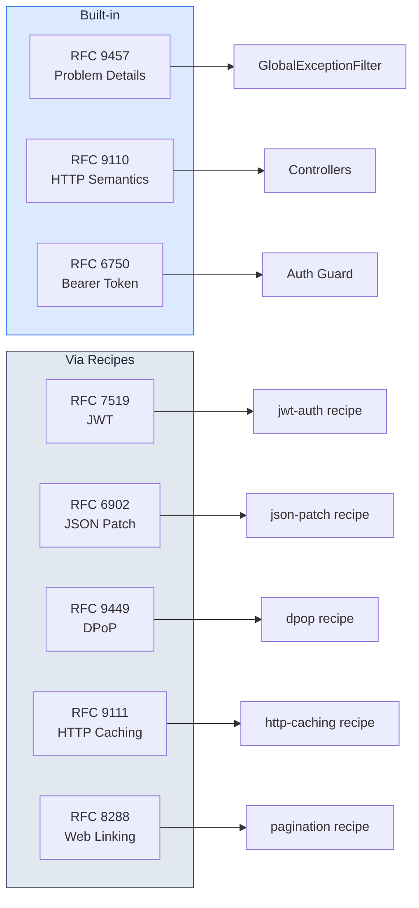

# Standards Compliance

Spoonfeeder implements, supports, and recommends a range of RFCs and open standards. This page tracks which standards are covered, organized by category, with links to the original specifications.

## Standards Map

The following diagram shows how key RFCs map to components in a generated project:

## Built Into Every Project

These standards are implemented in the base template and included in every generated project automatically.

| Standard | What it does | Implementation |
| --- | --- | --- |
| [RFC 9457](https://datatracker.ietf.org/doc/html/rfc9457) | Defines the `application/problem+json` error response format for HTTP APIs | `GlobalExceptionFilter` returns `type`, `title`, `status`, `detail`, `instance` fields |
| [RFC 9110](https://www.rfc-editor.org/rfc/rfc9110) | Standardizes HTTP method semantics, status codes, and header field definitions | Correct HTTP status codes and method semantics via NestJS controllers |
| [RFC 7807](https://datatracker.ietf.org/doc/html/rfc7807) | Original Problem Details spec, superseded by RFC 9457 | Backward compatible — RFC 9457 is the successor |
| [RFC 6750](https://datatracker.ietf.org/doc/html/rfc6750) | Specifies how to use Bearer tokens in HTTP Authorization headers | JWT auth recipe follows the Bearer scheme for token transmission |
| [JSON Schema](https://json-schema.org/) | Vocabulary for validating JSON structure and data types | `class-validator` + `ValidationPipe` for request validation |
| [RFC 9110 Section 8.8.3](https://www.rfc-editor.org/rfc/rfc9110#section-8.8.3) | Entity tags for conditional requests and cache validation | `@fastify/etag` plugin generates ETags and handles `If-None-Match` |

## Available via Recipes

These standards are available when the corresponding recipe is selected. They are grouped by category below.

### HTTP Semantics and API Design

Standards that define how HTTP requests and responses are structured, linked, and versioned.

| Standard | What it does | Recipe | Implementation |
| --- | --- | --- | --- |
| [RFC 8288](https://datatracker.ietf.org/doc/html/rfc8288) | Defines typed links between resources using HTTP `Link` headers | `pagination` | `Link` header with `rel=first,prev,next,last` |
| [RFC 7240](https://datatracker.ietf.org/doc/html/rfc7240) | Allows clients to express processing preferences via the `Prefer` header | `prefer-header` | `return=minimal`, `return=representation`, `respond-async` |
| [RFC 6902](https://datatracker.ietf.org/doc/html/rfc6902) | Defines a JSON format for expressing a sequence of patch operations | `json-patch` | `JsonPatchValidationPipe` validates `op`, `path`, `value` operations |
| [RFC 7396](https://datatracker.ietf.org/doc/html/rfc7396) | Defines a simpler merge-based approach to partial JSON updates | `json-merge-patch` | `MergePatchValidationPipe` for partial updates via `PATCH` |
| [RFC 6585](https://datatracker.ietf.org/doc/html/rfc6585) | Introduces additional HTTP status codes including 429 Too Many Requests | `throttler` | 429 Too Many Requests with `Retry-After` header |
| [RFC 9530](https://datatracker.ietf.org/doc/html/rfc9530) | Adds integrity digests to HTTP messages for content verification | `content-digest` | `Content-Digest` / `Repr-Digest` response headers |
| [IETF Draft](https://datatracker.ietf.org/doc/draft-ietf-httpapi-idempotency-key-header/) | Standardizes an `Idempotency-Key` header for safe request retries | `idempotency` | Middleware caches and replays responses by idempotency key |
| [OpenAPI 3.x](https://spec.openapis.org/oas/latest.html) | Machine-readable API description format for REST APIs | `swagger` | API documentation via `@nestjs/swagger` |

### Caching

Standards that govern HTTP caching behavior and conditional request handling.

| Standard | What it does | Recipe | Implementation |
| --- | --- | --- | --- |
| [RFC 9111](https://datatracker.ietf.org/doc/html/rfc9111) | Defines HTTP caching rules — `Cache-Control`, freshness, validation | `http-caching` | `Cache-Control`, ETag, conditional `If-None-Match` / `If-Modified-Since` |

### Security

Standards and guidelines that protect APIs from common attack vectors.

| Standard | What it does | Recipe | Implementation |
| --- | --- | --- | --- |
| [RFC 6749](https://datatracker.ietf.org/doc/html/rfc6749) | Defines the OAuth 2.0 authorization framework and grant types | `oauth-google`, `oauth-github`, `oauth-apple` | OAuth 2.0 flows via Passport strategies |
| [RFC 7519](https://datatracker.ietf.org/doc/html/rfc7519) | Defines JSON Web Tokens for compact, self-contained claims transfer | `jwt-auth` | JWT creation, validation, refresh via `@nestjs/jwt` |
| [RFC 9449](https://datatracker.ietf.org/doc/html/rfc9449) | Binds access tokens to a client key pair via Demonstrating Proof-of-Possession | `dpop` | `DPoPGuard` validates proof-of-possession JWTs |
| [RFC 6797](https://datatracker.ietf.org/doc/html/rfc6797) | Declares that a site must only be accessed over HTTPS via `Strict-Transport-Security` | `helmet` | `Strict-Transport-Security` header |
| [CORS (WHATWG Fetch)](https://fetch.spec.whatwg.org/#http-cors-protocol) | Controls which origins can access resources via `Access-Control-*` headers | `cors` | Fastify CORS plugin with configurable origins |
| [CSP Level 3](https://www.w3.org/TR/CSP3/) | Restricts resource loading to mitigate XSS and data injection attacks | `helmet` | `Content-Security-Policy` header |
| [CSRF (OWASP)](https://cheatsheetseries.owasp.org/cheatsheets/Cross-Site_Request_Forgery_Prevention_Cheat_Sheet.html) | Prevents cross-site request forgery via synchronizer tokens | `csrf` | Token-based CSRF protection |
| [OWASP API Top 10](https://owasp.org/www-project-api-security/) | Top 10 API security risks and mitigations | Multiple | Addressed via helmet, CORS, throttler, auth, validation |
| [OWASP Top 10](https://owasp.org/www-project-top-ten/) | Top 10 web application security risks | Multiple | Injection prevention (validation), broken auth (JWT), security headers |

### Observability

Standards for distributed tracing, metrics, and request correlation.

| Standard | What it does | Recipe | Implementation |
| --- | --- | --- | --- |
| [W3C Trace Context](https://www.w3.org/TR/trace-context/) | Standardizes `traceparent` / `tracestate` headers for distributed trace propagation | `opentelemetry`, `distributed-tracing` | Header propagation across service boundaries |
| [OpenTelemetry](https://opentelemetry.io/) | Vendor-neutral observability framework for traces, metrics, and logs | `opentelemetry` | Traces and metrics via `@opentelemetry/sdk-node` |

## Operational Standards

| Concern | Implementation |
| --- | --- |
| Request Timeout | Middleware aborts requests exceeding `REQUEST_TIMEOUT_MS` (default 30,000 ms), returns 408 |
| Graceful Shutdown | `enableShutdownHooks()` drains in-flight requests, closes DB/queue connections |
| Health Check Probes | `/health/live` (liveness), `/health/ready` (readiness), `/health/startup` (startup) via `@nestjs/terminus` |
| SSRF Prevention | Outbound HTTP calls validated against allow-listed hosts; private/link-local IP ranges blocked |
| Input Sanitization | `ValidationPipe` with `whitelist: true` strips unknown properties |
| Connection Pool Management | ORM pool sizes configurable via environment variables; pool exhaustion logged |

## Recommended Practices

These are not specific RFCs but are industry-standard practices followed by the boilerplate.

| Practice | Reference | Implementation |
| --- | --- | --- |
| Structured Logging | [12-Factor App: Logs](https://12factor.net/logs) | Pino/Winston JSON logging with request context |
| Health Checks | [draft-inadarei-api-health-check](https://datatracker.ietf.org/doc/html/draft-inadarei-api-health-check) | `/health` endpoint via `@nestjs/terminus` |
| Correlation IDs | Best practice | `x-correlation-id` header propagation via AsyncLocalStorage |
| Graceful Shutdown | Best practice | `enableShutdownHooks()` with connection draining |
| Circuit Breaker | Best practice | Opossum circuit breaker for external calls |
| API Versioning | Best practice | URI-based versioning (`/v1/`, `/v2/`) via `@nestjs/common` |
| Rate Limit Headers | [IETF Draft](https://datatracker.ietf.org/doc/draft-ietf-httpapi-ratelimit-headers/) | `RateLimit-*` headers via `@nestjs/throttler` |
