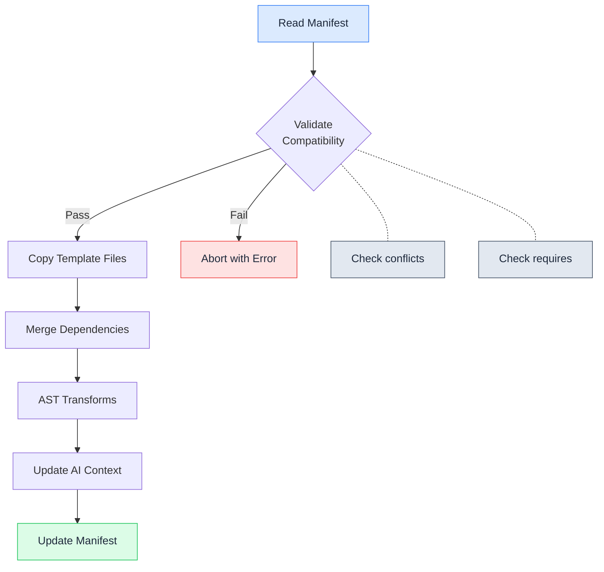

# Nx Generators

Recipes are not frozen at scaffolding time. Spoonfeeder ships Nx generators so you can evolve your stack after project creation — add new capabilities, remove unused ones, or migrate between compatible recipes.

## Available Generators

| Generator | Command | Description |
| --- | --- | --- |
| [Add](add.md) | `nx g spoonfeeder:add` | Add a recipe to an existing project |
| [Remove](remove.md) | `nx g spoonfeeder:remove` | Remove a recipe cleanly |
| [Migrate](migrate.md) | `nx g spoonfeeder:migrate` | Migrate between compatible recipes |
| List | `nx g spoonfeeder:list` | List all available and installed recipes |

## Generate-time vs Post-scaffolding

The CLI (`pnpm create-spoonfeeder`) and Nx generators both install recipes, but they operate at different stages.

| Aspect | CLI (generate-time) | Nx Generators (post-scaffolding) |
| --- | --- | --- |
| **When it runs** | Project creation | Any time after the project exists |
| **Input** | Interactive prompts or preset file | Explicit `--recipe` / `--from` / `--to` flags |
| **Scope** | Full project scaffold: folder structure, `package.json`, `tsconfig.json`, CI/CD, Docker, etc. | Single-recipe changes only |
| **Conflict resolution** | All recipes selected at once, validated as a set before any files are written | Validated against the current `.spoonfeeder.json` manifest |
| **File generation** | Creates every file from scratch using EJS templates | Patches existing files (adds/removes imports, env vars, dependencies) |
| **AI context** | Generates `CLAUDE.md`, `.cursor/rules/project.mdc`, `.github/copilot-instructions.md` with all selected recipes | Appends or removes recipe-specific sections in existing AI context files |
| **Rollback** | Discard the generated directory | Use `nx g spoonfeeder:remove` to undo |
| **Typical use** | Greenfield project setup | Evolving an existing project |

## When to Use Generators

**Adding a capability you did not pick at scaffold time.** You created an `http-api` project with `jwt-auth` and `typeorm-postgres`, and now you need API documentation. Run `nx g spoonfeeder:add --recipe=swagger` instead of manually wiring `@nestjs/swagger`, updating `main.ts`, and adding env vars.

**Removing a recipe you no longer need.** You shipped with `nodemailer` for transactional emails but switched to a third-party service that handles delivery. Run `nx g spoonfeeder:remove --recipe=nodemailer` to strip the dependency, env vars, source files, and module registration in one step.

**Swapping one technology for another.** Your team decides to move from TypeORM to Prisma. Run `nx g spoonfeeder:migrate --from=typeorm-postgres --to=prisma` to atomically remove the old recipe and add the new one, then follow the printed migration guidance to convert your application code.

**Auditing what is installed.** Run `nx g spoonfeeder:list` to see every recipe that is currently active and which ones are still available. Useful before a dependency audit or when onboarding a new team member.

!!! tip
    Always run `--dry-run` first to preview changes before they are written to disk. Every generator supports it.

## Generator Workflow

The `add-recipe` generator follows this workflow to safely add a recipe to an existing project:



## How Generators Work

Each generator handles the full lifecycle of a recipe change:

1. **Validates** the operation against the current recipe set (conflicts, requirements)
2. **Modifies** `package.json` (adds or removes dependencies with exact versions)
3. **Generates or removes** source files, configuration modules, and templates
4. **Updates** `app.module.ts` imports and registrations
5. **Updates** environment variable files (`.env.example`, `.env.*`)
6. **Updates** AI context files (`CLAUDE.md`, `.cursor/rules/<recipe-id>.mdc`, `.github/copilot-instructions.md`)
7. **Generates or removes** test files

## Prerequisites

Nx must be available in the project. Generated projects include Nx as a dev dependency:

```bash
pnpm add -D -E nx
```

## Listing Recipes

To see all available recipes and which ones are currently installed:

```bash
nx g spoonfeeder:list
```

This displays the full recipe catalog with installation status, making it easy to see what is available and what is already in use.

## No Lock-In

Add what you need, remove what you do not. The generators ensure clean transitions with no orphaned code or stale configuration.
