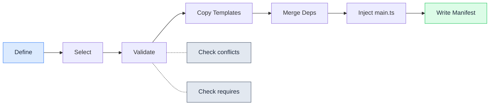

# Recipe System

Recipes are the building blocks of a spoonfeeder project. Each recipe encapsulates a single capability — a database integration, an auth strategy, a cloud service — and ships everything needed to use it: dependencies, source files, configuration, environment variables, tests, and AI context.

## Recipe Lifecycle

Each recipe passes through a defined lifecycle during project generation:

## How Recipes Work

When you select a recipe during scaffolding, spoonfeeder:

1. **Adds dependencies** to `package.json` with exact versions (no `^` or `~`)
2. **Generates source files** from templates into the correct directories
3. **Registers modules** in `app.module.ts`
4. **Adds environment variables** to `.env.example` and per-environment `.env` files
5. **Generates test files** in the `tests/` directory
6. **Updates AI context** in `CLAUDE.md`, `.cursor/rules/project.mdc`, and `.github/copilot-instructions.md`

## Conflicts and Requirements

Recipes declare their relationships explicitly:

- **Conflicts** — Recipes that cannot be used together. For example, `typeorm-postgres` conflicts with `prisma` and `mongoose` because you should pick one ORM.
- **Requirements** — Recipes that depend on another recipe. For example, `auth-flows` requires `jwt-auth` because it builds on JWT-based authentication.
- **Compatibility** — Each recipe lists which project types it supports. Some recipes work with all project types; others are limited to HTTP APIs or specific architectures.

The CLI validates all three constraints before generating. If you select an incompatible combination, you get a clear error before anything touches disk.

## Smart Defaults

When you select a cloud provider, spoonfeeder pre-selects relevant recipes:

- **AWS** — Highlights AWS SQS, SNS, S3, Cognito, Secrets Manager, and other AWS services
- **GCP** — Highlights Pub/Sub, Cloud SQL, Firestore, Cloud Functions, and other GCP services
- **Azure** — Highlights Service Bus, Cosmos DB, Blob Storage, Functions, and other Azure services

You can add or remove any recipe from the defaults.

## Best Practices Recipes

Some recipes are selected by default for all project types because they represent best practices:

- **Helmet** — Security headers
- **CORS** — Cross-origin resource sharing
- **Rate Limiting** — Request throttling
- **Health Checks** — Liveness and readiness endpoints
- **Graceful Shutdown** — Clean connection draining

These can be deselected if they are not needed for your use case.

## Recipe Categories

| Category | Count | Description |
| --- | ---: | --- |
| [Database](database.md) | 10 | ORMs, ODMs, caching, soft delete, audit trail, seeding |
| [Authentication](auth.md) | 11 | JWT, Passport, OAuth providers, RBAC, MFA, DPoP |
| [Security](security.md) | 6 | Helmet, CORS, CSRF, rate limiting, content digest, data masking |
| [Cloud — AWS](cloud-aws.md) | 12 | SQS, SNS, S3, DynamoDB, Cognito, EventBridge, and more |
| [Cloud — GCP](cloud-gcp.md) | 10 | Pub/Sub, Cloud SQL, Firestore, Cloud Functions, and more |
| [Cloud — Azure](cloud-azure.md) | 10 | Service Bus, Cosmos DB, Blob Storage, Functions, and more |
| [API Patterns](api-patterns.md) | 15 | Pagination, versioning, JSON Patch, SSE, i18n, and more |
| [Observability](observability.md) | 3 | OpenTelemetry, distributed tracing, request logging |
| [Queues & Messaging](queues.md) | 3 | RabbitMQ, BullMQ, dead letter queues |
| [Developer Experience](dx.md) | 7 | Dev containers, config validation, SDK generation, AdminJS |
| + 14 more | 25 | Logging, monitoring, error tracking, storage, email, and others |

See the [Full Recipe List](all.md) for every recipe with dependencies and configuration details.
